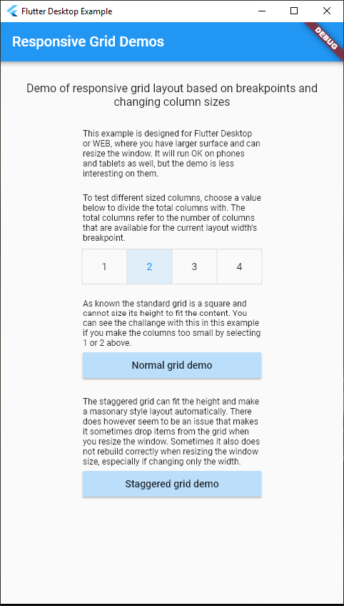
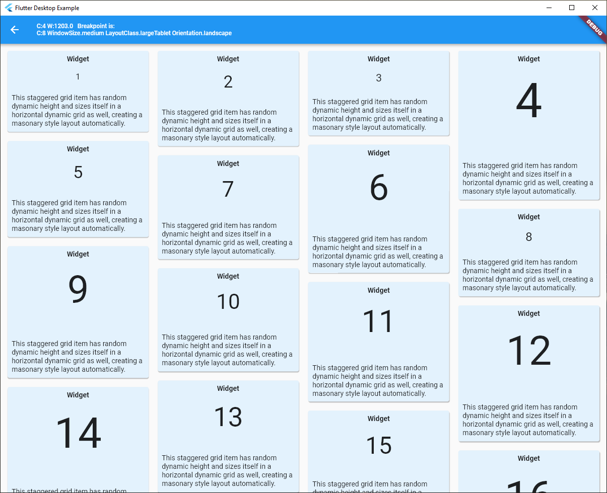

# resp_stag_grid

Short example of how to use breakpoints to layout a grid in Flutter WEB and 
Desktop using Flutter's standard GridView and Romain Rastel's StaggeredGridView.

**This version is using Staggered Grid 0.4.1.**

Flutter master v1.10.3-pre.67 on a Windows 10 desktop 18.9.2019
The old build is still published [here](https://rydmike.com/gridtest/#/).
That version demoed how to set up Flutter WEB and Desktop
in the same project. Back then you needed 'dart.io' in Flutter Desktop, but
that does not compile in Flutter WEB. To get around this the use of a
conditional Dart lib import was needed and demonstrated. Staggered Grid version
[0.3.0](https://pub.dev/packages/flutter_staggered_grid_view/versions/0.3.0)
was used in that build.

These extra setups for combined desktop and web build are no longer needed.
After the old project's null-safety migration, we can build the same demo from 
2019 with Flutter 2.8.0 and latest package versions. When we do, we can however
still see the issues with Staggered Grid remain in that build when using 
[Staggered Grid v 0.4.1](https://pub.dev/packages/flutter_staggered_grid_view/versions/0.4.1)

It can be tested here:

If we switch to the new version 
[0.5.0-dev.1](https://pub.dev/packages/flutter_staggered_grid_view/versions/0.5.0-dev.1) 
the issues are solved.

The API in version 0.5.0-dev.1 is totally revised from 0.4.1 and it no longer
supports the generic staggered grid layout using an infinite builder. It is only 
intended for a small amount of items, like row and column. It does however have 
a new **MasonryGridView** layout that fills most needs. It also gains a number 
of new interesting layouts not shown in this demo.

For comparison the new version 0.5.1-dev.1 can be tested here:

It no longer shows the resizing issues and is much faster.

## Demonstrated features

Demo of responsive grid layout based on breakpoints and dynamic column numbers 
and widths

This example is designed for Flutter Desktop or WEB where you have larger 
surface and can resize the window. It will run OK on phones and tablets as 
well, but the demo is less interesting on them.

To test different sized columns, choose a value below to divide the total 
columns with. The total columns refer to amount of columns that are available 
for the breakpoint at current layout width.

- The Flutter Standard Grid works as expected. As known the standard grid is a rectangle and cannot size its height to fit the content. You can see the challenge with this in this example if you make the columns too small by selecting 1 or 2 in the select control. The selected value will divide the totally available columns in the breakpoint, for the active window width.

- The staggered grid can adjust its height and make a masonry style layout. Prior to version **0.5.0-dev.1** there is an **issue** that makes the StaggeredGridView **sometimes drop items** in the grid when you resize the window width and sometimes it **does not rebuild correctly** when resizing the window size, especially if changing only the width. The issue has been observed in both the WEB and Desktop build (Win10), using Flutter version, **v1.10.3-pre.67 and all later version** pointing to an issue in the package. 

- Usage of the in Flutter 1.9 introduced new ToggleButtons widget is also demonstrated as a control for selecting the divisor of the total amount columns for the given breakpoint width. This is used to demonstrate how to make wider columns for the grid views in the grid layout.

- The demo was updated to null safety 12.12.2021, to test latest stable version and dev release of the StaggeredGridView.

## Preview

Start screen, select column divisor and try the responsive grid layout with a standard grid or the masonry style StaggeredGridView layout.

 

Example of dynamic staggered grid layout

Animated GIF that also shows the issue with the staggered grid layout prior to version 0.5.0-dev.1.

